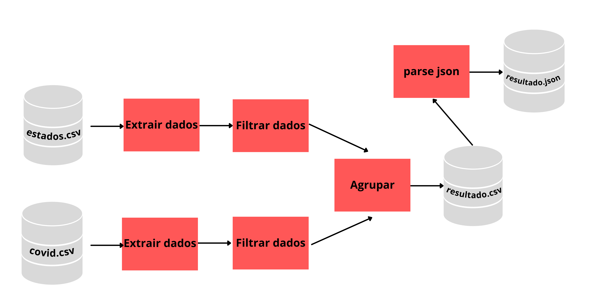

# Desafio Data Engineer

O projeto consiste na criação de um pipeline de dados que extraia dados de dois arquivos csv, selecione algumas features e retorne como resultado um arquivo .csv e um arquivo .json válido. 

Para auxiliar na criação desse pipeline foi utilizada a ferramenta Apache beam, que lida muito bem com tasks facilmente paralelizáveis.

# Pipeline Dataflow
Representação geral do pipeline



# Escolha dos filtros

Os filtros foram escolhidos a fim de remover dados desnecessários como casos de covid nacionais e municipais. Com o objetivo de evitar operações desnecessárias, foi utilizado a última coleta de dados como a soma total dos casos e dos óbitos.

# Escolha de algumas formatações

Com a natureza paralela do apache beam, ao fazermos o merge através da função beam.Flatten() não conseguimos garantir a ordem das Pcollections na Pcollection resultante, por isso, em algumas funções, precisamos reorganizar o posicionamento das features.

# Dependências

para instalar as dependências basta usar o comando 

```
pip install -r requirements.txt 
```

# Modo de usar

para executar o pipeline basta usar o seguinte comando

```
python script.py
```

# Documentação
[docs](docs/_build/html/index.html)
